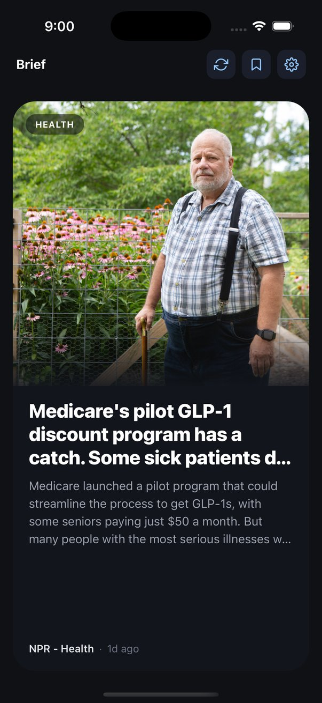

# Brief

A mobile news reader built with Expo (React Native + TypeScript). Aggregates live
public RSS feeds into a single swipeable card interface — no API key required.
Configurable by topic, with scheduled local notifications for a daily digest.

Topics covered: Technology, AI/ML/Computer Vision/NLP, System Design, Politics,
Finance, Science, Health, and Education.



## Running it on your phone

You don't need Xcode or Android Studio — just the free **Expo Go** app.

1. Install dependencies (only needed once) from the repo root:
   ```bash
   npm install
   ```
2. Start the dev server:
   ```bash
   npx expo start
   ```
3. Install **Expo Go** on your phone (App Store / Google Play).
4. Scan the QR code printed in the terminal with your phone's camera (iOS) or the
   Expo Go app (Android). The app opens on your device, connected live to your
   computer — edits you make to the code hot-reload on the phone.

Your computer and phone need to be on the same Wi‑Fi network. If the QR code
connection doesn't work, press `w` in the terminal to try the web preview instead,
or switch the dev server to tunnel mode (press `s` then choose "tunnel" in the
Expo CLI, or run `npx expo start --tunnel`).

The web preview is fine for checking layout and navigation. Most publisher RSS
hosts do not send CORS headers, so the in-browser feed will miss many sources
(a few, such as NASA APOD, may still load). Expo Go / a native build is the
supported way to read the full feed.

To run in a simulator instead of a physical phone (requires Xcode/Android Studio):
```bash
npx expo start --ios       # iOS Simulator
npx expo start --android   # Android Emulator
```

## How it works

- **Onboarding** — first launch asks you to pick topics and a daily digest time.
  Saved to on-device storage (`AsyncStorage`), so it only runs once.
- **Feed** — a gesture-driven card deck (`SwipeCardStack`, built on
  `react-native-gesture-handler` + `react-native-reanimated`). Each card renders an
  image, headline, source, timestamp, and a ~60-second summary. Swiping right saves
  the story, left dismisses it; crossing ~28% of screen width or exceeding a
  velocity threshold commits the action and the card exits, with a bookmark or X
  icon fading in during the drag to indicate which action is pending. Tapping
  without dragging opens the source article. A left-swipe also writes a last-skip
  pending undo (the article plus a timestamp) to AsyncStorage and shows a ~4s
  **Skipped · Undo** bar; tapping Undo unskips that story and pins it to the front
  of the deck. The bar auto-hides without clearing storage — relaunching within 5
  minutes shows Undo again, but does not auto-restore the card. A newer skip
  overwrites the pending undo (stack of one). Once all stories in the selected
  topics are exhausted, an empty-state screen provides a manual refresh control
  and, if any stories were dismissed, an option to restore them all.
- **Saved** — a plain list of everything you've swiped right on, with a thumbnail,
  tap-to-open, and a remove button. Reachable from the Feed header.
- **Settings** — change your topics or notification time anytime.
- **Daily notification** — a local notification (via `expo-notifications`) fires
  once a day at your chosen time with a couple of headlines from your topics. No
  server or push infrastructure involved — it's scheduled entirely on-device.

### Article images

Each RSS item is checked, in order, for `media:content`, `media:thumbnail`,
`media:group > media:content`, `enclosure`, and finally the first `` inside
`content:encoded`/`description`. When a feed offers more than one size (some
publishers list several `media:content` variants), the largest is picked; if the
best size a feed declares is still under 300px on its shorter side (Yahoo
Finance and BBC both ship ~130–240px thumbnails, for example), it's treated as
too small to show full-bleed and skipped in favor of the fallback below —
stretching a tiny thumbnail to card size just looks blurry.

If none of the above are present or usable (arXiv and ScienceDaily's feeds, for
example, carry no image at all), the app lazily fetches the article page itself
and scrapes its `og:image`/`twitter:image` meta tag — only for cards currently in
the visible stack (top 3), so this never blocks the feed from rendering. The
resolved (or "not found") result is cached per-article in AsyncStorage
(`src/services/storage.ts`, `getCachedImage`/`setCachedImage`) so it's never
re-scraped. If no image can be found at all, the card falls back to a
category-colored, typographic placeholder instead of a broken image box.
Rendering and on-device caching (memory + disk) is handled by `expo-image`, with
a light gradient at the very bottom of the photo (not a heavy overlay) so the
image stays clear and just blends into the card below it.

News comes straight from each publisher's public RSS feed (see the full list in
`src/data/feeds.ts`) — Ars Technica, MIT Technology Review, arXiv (cs.LG/cs.CV/cs.CL),
Netflix/AWS/HighScalability engineering blogs, BBC/NPR/Slashdot politics, Yahoo
Finance, WSJ Markets, ScienceDaily, NASA, and several education outlets. Article
bodies are not scraped; the only HTML fetch outside RSS is the optional
`og:image`/`twitter:image` lookup described above, used when a feed item has no
usable image. No API key is needed.

## Project structure

```
src/
  types/            Shared TypeScript types (Article, Category, UserPreferences, ...)
  data/feeds.ts      Category list + RSS feed source URLs
  services/
    rss.ts           Fetches + parses RSS/RDF/Atom feeds into Article[], incl. image extraction
    summarizer.ts     Turns a raw RSS description into a ~60-second digest
    ogImage.ts        Best-effort og:image/twitter:image scrape, used as an image fallback
    storage.ts        AsyncStorage helpers (preferences, saved articles, skipped ids, pending undo, image cache)
    notifications.ts  Schedules the daily local notification
  hooks/useArticleImage.ts   Resolves an article's image: feed → cache → og:image scrape
  context/PreferencesContext.tsx   App-wide preferences state
  screens/           Onboarding, Feed, Saved, Settings
  components/        NewsCard, ArticleImage, SwipeCardStack, TimePicker
  navigation/        Stack navigator (Onboarding -> Feed <-> Settings/Saved)
```

## Plugging in a better summarizer

Right now, summaries are produced by `RuleBasedSummarizer` in
`src/services/summarizer.ts` — it strips HTML from the RSS `<description>` and
truncates it to a target word count (~3.3 words/second of reading). It's behind a
small interface:

```ts
export interface Summarizer {
  summarize(title: string, rawDescription: string | undefined, targetSeconds?: number): string;
}
```

To use an LLM instead (e.g. to properly compress long descriptions or the full
article body instead of just truncating), implement that interface — for example:

```ts
// src/services/llmSummarizer.ts
export class LLMSummarizer implements Summarizer {
  async summarize(title: string, rawDescription: string | undefined, targetSeconds = 60) {
    // call your LLM endpoint here, prompt it to produce a ~60-second summary
  }
}
```

Then swap the export in `src/services/rss.ts` (`import { defaultSummarizer } from
'./summarizer'`) to point at your new implementation. Note `summarize` is currently
called synchronously inside `fetchFeed` — if your implementation is async (an LLM
call almost certainly will be), change that call site to `await` it and consider
caching results locally (e.g. in `storage.ts`) so you're not re-summarizing on every
feed refresh.

## Known limitations / next steps

- The daily notification's headline text is generated once, at the moment you
  save your preferences/time — it won't refresh with new headlines each morning
  without the app being opened. A background fetch task (`expo-background-fetch` +
  `expo-task-manager`) could refresh it daily, but that requires a native build
  (won't work in Expo Go).
- A couple of feeds (e.g. Yahoo Finance) don't include a description in their RSS,
  so those cards fall back to showing just the headline.
- No offline caching of the feed yet — each open re-fetches from all selected
  sources (which does mean you're always seeing the latest available articles,
  sorted newest-first — there's no stale-cache layer to go out of date).
- Skip undo is last-in only (a stack of one) and expires after 5 minutes. There is
  no undo for a save. The empty-deck "Show skipped stories again" control still
  bulk-restores every dismissed story and clears any pending undo.

## If you upgrade react-native-reanimated

Expo Go ships a fixed, precompiled native binary — the JS-side
`react-native-worklets` version (Reanimated 4's separate native-worklets package,
not `react-native-reanimated` itself) **must exactly match** the version baked into
whatever Expo Go build you're running, or the app crashes on launch with
`Exception in HostFunction` inside `NativeWorklets`, before any of your code runs.
This project pins it explicitly in `package.json`:
```json
"react-native-worklets": "0.5.1"
```
That's the exact version listed for SDK 54 in `expo/bundledNativeModules.json` —
without the pin, npm resolves `react-native-worklets` to whatever the newest
version satisfying `react-native-reanimated`'s internal range is (which drifts
ahead of what Expo Go actually ships). If you bump `expo`/`react-native-reanimated`,
re-check that file for the version Expo Go for your new SDK expects and update the
pin to match. Also note `babel.config.js` must list `react-native-worklets/plugin`
(not the older `react-native-reanimated/plugin`, which Reanimated 4 moved out).

## CI/CD

`.github/workflows/ci.yml` runs on every push/PR to `main`: installs deps,
type-checks (`tsc --noEmit`), runs `expo-doctor` (advisory — flags dependency
issues without blocking merges), and does a bundle sanity check
(`expo export --platform web`) to catch Metro/bundling regressions the same way
this project's been manually verified throughout development.

### EAS Update (OTA) — scaffolded, not fully linked

`eas.json` defines `preview` and `production` build profiles with update
channels. `app.json` sets `runtimeVersion.policy` to `appVersion` so OTA
updates stay compatible with a given native binary.

What is **intentionally not** in the repo (needs an Expo account, and must not
be invented):

- `expo.extra.eas.projectId`
- `expo.updates.url` (`https://u.expo.dev/<projectId>`)
- the `expo-updates` package (installed by `eas update:configure`)

`.github/workflows/cd.yml` publishes an OTA update via
[EAS Update](https://docs.expo.dev/eas-update/introduction/) on every push to
`main`. It **no-ops** until you activate it, so it won't fail CI in the
meantime.

#### Activating OTA CD

These steps require an interactive Expo login — they cannot be completed in a
headless clone without credentials:

1. From the repo root, with EAS CLI:
   ```bash
   npx eas-cli@latest login
   npx eas-cli@latest init --non-interactive   # links the project; writes extra.eas.projectId
   npx eas-cli@latest update:configure         # writes updates.url + installs expo-updates
   ```
   If `eas init` prompts because the project isn't linked yet, run it without
   `--non-interactive` and accept the Expo project it creates for this slug
   (`news-app`). Do not paste a made-up UUID into `app.json`.
2. Commit the files `eas init` / `eas update:configure` changed (`app.json`
   and `package.json` / lockfile if `expo-updates` was added).
3. Generate an access token at
   https://expo.dev/accounts/[account]/settings/access-tokens
   and add it as a GitHub Actions **secret** named `EXPO_TOKEN`
   (repo Settings → Secrets and variables → Actions → Secrets).
4. Add a GitHub Actions **variable** named `EAS_PROJECT_LINKED` set to `true`
   (same page → Variables tab) — this is the switch that turns the workflow on.

Until step 4, the `deploy` job is skipped on every run. This only publishes a
JS/asset OTA update to whoever already has a matching native build installed —
it doesn't build or submit a new binary to the App Store/Play Store.

#### Remaining store / native-build steps

OTA updates are not a substitute for the first native binary. Before
`eas build` / `eas submit` you still need to (locally, with your Apple/Google
accounts):

1. Set unique identifiers in `app.json` — `expo.ios.bundleIdentifier` and
   `expo.android.package` (EAS will prompt if they're missing; pick values you
   own, e.g. `com.yourname.brief`).
2. Create an EAS project if you skipped `eas init` above.
3. Run a store or internal build:
   ```bash
   npx eas-cli@latest build --platform ios --profile production
   npx eas-cli@latest build --platform android --profile production
   ```
   (`npx eas-cli@latest build --platform all` is the same first credentials
   pass in one command.)
4. Submit with `npx eas-cli@latest submit --platform ios|android --profile production`
   once the stores have your developer accounts, signing keys, and listing
   metadata. `eas.json`'s `submit.production` block is an empty placeholder
   until those credentials exist.

Expo Go (`npx expo start`) remains the way to develop without a custom native
build. EAS Update only applies to binaries produced by EAS Build (or a
dev client), not to Expo Go.

### Production native builds (EAS Workflows)

[EAS Workflows](https://docs.expo.dev/eas/workflows/get-started/) can create
production Android and iOS binaries from
`.eas/workflows/create-production-builds.yml`. After that file is on the
branch, trigger it from the repo root (requires `eas login` and a linked
project):

```bash
npx eas-cli@latest workflow:run create-production-builds.yml
```

The first credentials pass still has to happen locally (see the store /
native-build steps above): native signing keys aren't generated by the
workflow file itself. On your machine, once:

```bash
npx eas-cli@latest build --platform all
```

That interactive run stores Android/iOS credentials on Expo's servers so later
workflow builds can reuse them. Do not commit keystores, `.p8`/`.p12` files, or
other signing secrets — they stay in EAS, not in this repo.
